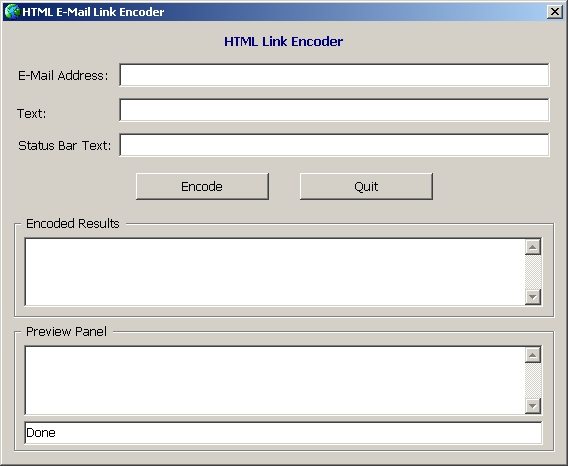



## E\-Mail Link Encoder

### Description

This code will encode HTML link's. Encoding E-Mail links on websites can help prevent spammers obtaining your email address.
 
### More Info
 
E-mail Address, Test to display on screen, Status bar text (Optional).

Encoded E-Mail link.

There are no side affects.

             |
---                |---
**Submitted On**   |2002-12-30 08:59:34
**By**             |[Terry Rogers](https://github.com/Planet-Source-Code/PSCIndex/blob/master/ByAuthor/terry-rogers.md)
**Level**          |Intermediate
**User Rating**    |4.7 (14 globes from 3 users)
**Compatibility**  |VB 6\.0
**Category**       |[Internet/ HTML](https://github.com/Planet-Source-Code/PSCIndex/blob/master/ByCategory/internet-html__1-34.md)
**World**          |[Visual Basic](https://github.com/Planet-Source-Code/PSCIndex/blob/master/ByWorld/visual-basic.md)
**Archive File**   |[E\-Mail\_Lin15209812312002\.zip](https://github.com/Planet-Source-Code/terry-rogers-e-mail-link-encoder__1-41991/archive/master.zip)

